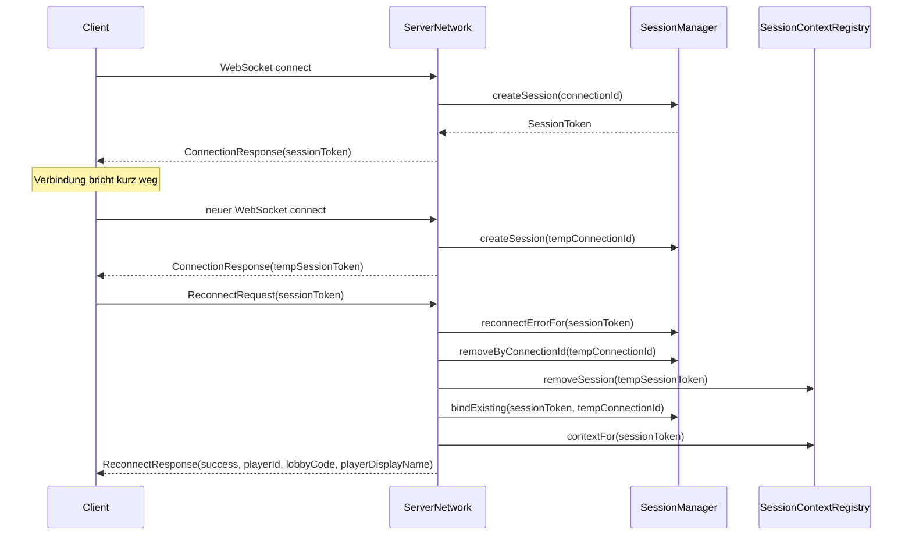

# Reconnect Session Flow

## Ziel

Das Reconnect-System trennt bewusst zwischen zwei technischen Identitäten:

- `ConnectionId`: identifiziert genau eine aktive WebSocket-Verbindung
- `SessionToken`: identifiziert die stabile Client-Session über Verbindungsabbrüche hinweg

Der Server kann damit eine kurzzeitig verlorene Verbindung neu an eine bestehende Session binden, ohne den
Spieler- oder Lobby-Kontext zu verlieren.

## Ablauf

## Serverzustand

### SessionManager

Der `SessionManager` verwaltet die technische Lebensdauer eines `SessionToken`.

- Beim initialen Connect wird ein neuer Token erzeugt.
- Jeder Token besitzt eine serverseitige TTL.
- Ein Token kann explizit invalidiert werden.
- Beim erfolgreichen Reconnect wird dieselbe Session an eine neue `ConnectionId` gebunden.
- Die zuvor aktive Verbindung wird serverseitig geschlossen, damit keine Doppelzuordnung bestehen bleibt.

### SessionContextRegistry

Die `SessionContextRegistry` hält fachnahen Reconnect-Kontext pro `SessionToken`.

- stabile `PlayerId`
- aktuelle `LobbyCode`
- letzter `playerDisplayName` innerhalb der Lobby

Dieser Kontext bleibt bei einem normalen Disconnect bestehen und wird erst entfernt, wenn:

- eine provisorische Session durch einen erfolgreichen Reconnect ersetzt wird
- eine Session explizit vollständig entfernt wird

## Aktualisierung des Lobby-Kontexts

`MainServerLobbyRoutingService` aktualisiert den Reconnect-Kontext nur nach erfolgreichen fachlichen Operationen:

- `JoinLobbyRequest`: speichert `LobbyCode` und `playerDisplayName`
- `LeaveLobbyRequest`: entfernt den Lobby-Kontext
- `KickPlayerRequest`: entfernt den Lobby-Kontext des Zielspielers

Dadurch enthält `ReconnectResponse` genau den Zustand, den der Server auch für spätere Lobby-Broadcasts verwendet.

## Fehlerfälle

`ReconnectResponse` liefert standardisierte Fehlercodes:

- `TOKEN_INVALID`: Token ist unbekannt
- `TOKEN_EXPIRED`: Token existiert, ist aber abgelaufen
- `TOKEN_REVOKED`: Token wurde serverseitig invalidiert

Diese Fehler werden direkt aus dem `SessionManager` abgeleitet.
